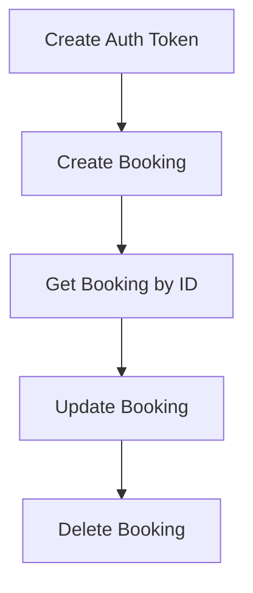

# Restful Booker API Automation


## Overview

This project provides automated tests and utilities for the [Restful Booker API](https://restful-booker.herokuapp.com/), using Java, RestAssured, and TestNG. It covers end-to-end scenarios for booking creation, retrieval, update, deletion, and authentication.

## Features
- Create, retrieve, update, and delete bookings
- Token-based authentication
- Modular request specifications
- TestNG-based test execution
- WireMock support for API mocking
- Allure reporting (if configured)

## Project Structure
```
Restful_Booker/
├── src/
│   ├── main/
│   │   └── java/api/         # API client classes
│   └── test/                 # Test classes (not shown)
├── pom.xml                   # Maven configuration
├── testNG.xml                # TestNG suite config
└── README.md                 # Project documentation
```

## Main API Operations
| Operation         | Java Class                | HTTP Method | Endpoint            |
|-------------------|--------------------------|-------------|---------------------|
| Create Booking    | `CreateBooking`          | POST        | `/booking`          |
| Get Booking by ID | `GetBookingCreatedByID`  | GET         | `/booking/{id}`     |
| Update Booking    | `PutCreatedBooking`      | PUT         | `/booking/{id}`     |
| Delete Booking    | `DeleteBookingCreated`   | DELETE      | `/booking/{id}`     |
| Auth Token        | `CreateAuth`             | POST        | `/auth`             |

## Workflow Visualization



## Getting Started

### Prerequisites
- Java 8 or higher
- Maven 3.6+

### Setup
1. Clone the repository:
   ```sh
   git clone <your-repo-url>
   cd Restful_Booker
   ```
2. Install dependencies:
   ```sh
   mvn clean install
   ```
3. Run tests:
   ```sh
   mvn test
   ```

### Generating Allure Report (if configured)
```sh
mvn allure:serve
```

## Contributing
Pull requests are welcome. For major changes, please open an issue first to discuss what you would like to change.

## License
[MIT](LICENSE)

---
*This README was generated automatically. Update badges and links as needed.*

